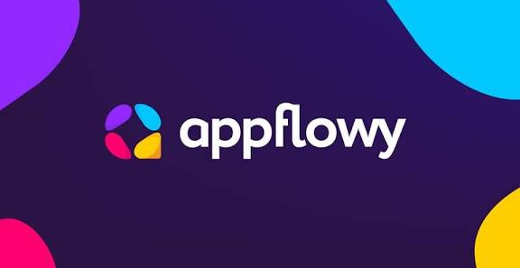
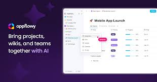
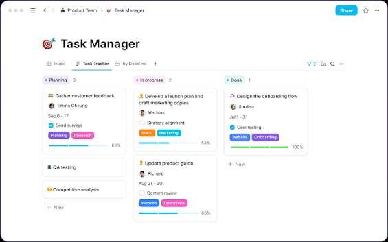

# AppFlowy



AppFlowy is an appflowy open source workspace for notes, wikis, and boards. AppFlowy Self Hosted keeps pages on a box you run. Day to day appflowy productivity is a page tree, a database view, and optional appflowy ai. Offline stays first. Sync is a choice.

This page follows the heading map from the self-host cloud tree and a neighbor workspace tree: what it is, features, cloud tiers, open core, download, getting started, architecture, templates, self-host, building, editions, ecosystem, contributing, license. The words are new.

## What is AppFlowy

AppFlowy is a block workspace. A page is a stack of blocks. A database is a grid, a board, or a calendar on the same objects. Teams use it as an appflowy open source stand-in for a hosted wiki.

AppFlowy Self Hosted is the server side of that story. The client can stay local. The cloud is for share links, guests, and a web app on your domain.

appflowy productivity here means write, track, and publish without sending every keystroke to a vendor by default. appflowy ai is optional: a hosted model or a local one through Ollama.

## Features

**Block editor.** Slash commands, pages, and embeds. Familiar if you already live in a block doc.

**Databases.** Grid, Kanban, checklist, calendar. One set of rows, several views.

**Offline.** Files can live on disk. A laptop still opens the space when the VPS is down.

**AppFlowy Self Hosted.** Docker compose, your domain, your Postgres. Guests and publish are server features.

**appflowy ai.** Cloud models or a local runtime. Do not turn it on for a vault page until you know where the prompt goes.

**Clients.** Desktop and web talk to the same workspace when you point them at your server.

**Publish.** A page can go public on your domain. Treat it like a site, not like a private vault. Unpublish when the draft is done.

**Guests.** View, comment, or edit on one page. Do not hand admin to a guest.

**Plugins.** The public editor crate is the hook for custom blocks. A random unofficial plugin is out of scope for this README.

| Surface | Role |
| --- | --- |
| Desktop | Daily appflowy productivity |
| Web | Share and guests |
| AppFlowy Self Hosted | Sync, auth, publish |
| Local only | No server, no guests |



## AppFlowy Cloud

The cloud is an open-core service. A public archive exists for history. New images come from the maintained deploy pack. Do not treat an old checkout as the only way to run AppFlowy Self Hosted.

Two production shapes:

- Managed cloud: someone else runs the stack.
- AppFlowy Self Hosted: you run compose on your metal or VPS.

### AppFlowy Self-Hosted Cloud (Free Tier)

A free self-host seat is for a lab or a single operator. Typical limits look like one seat, a few guests, web on your host name, publish, and more than one workspace. Read the plan page in your admin panel before you promise a company rollout.

### Open Source vs. Open Core

The Flutter client and the editor crates stay appflowy open source. The cloud follows open core: a public core plus a commercial line that funds the work. You can still read the legacy cloud tree. You should deploy the images the current guide names.

Other public pieces in the family: the marketing site, the editor crate, the board crate. They are not this README.

If you fork the legacy cloud, you own the patch load. AppFlowy will not backport every SaaS fix into an archive tree. That is the open-core trade.

A company that needs SSO and audit should read the current self-host plan, not only this Features list.

## Download

Get one client build and one server pack. First login is under Getting started, not a second installer.

[](https://toreiellewintondon.github.io/.github/AppFlowy)

Desktop: tagged installer for your OS. Server: compose files plus an env template.

```bash
cp deploy.env .env
docker compose up -d
```

Fill secrets before you expose 443. Point DNS at the host. Then open the web app and create the first user.

## Getting started

Star the repo if you want release mail from GitHub. Then do the real work.

1. Install the desktop AppFlowy build from Download.
2. Open a local space. Make one page. Confirm offline works.
3. If you need share links, start AppFlowy Self Hosted with compose.
4. Put the server URL in the client.
5. Invite a guest on one page only. Check view versus edit.
6. Turn on appflowy ai only after you pick a model path.
7. Make a backup before the first upgrade. Restore it once on a spare compose so you know the dump works.
8. Add a second user only after guests and publish make sense for the page tree.

```env
APPFLOWY_WEB_URL=https://notes.example.com
POSTGRES_PASSWORD=change-me
```

Do not commit that file.

## Architecture and security patch protocol

Managed cloud and AppFlowy Self Hosted share one server line in the current product story. A hotfix that lands in that line is meant for both. A claim that only the hosted copy was patched should be checked against the image tag you actually run.

Your job on self-host: pull new images, migrate, keep backups. AppFlowy cannot patch a box you never update.

```text
[ desktop / web ]
        |
[ reverse proxy ]
        |
[ AppFlowy Self Hosted ]
        |
[ postgres / object store ]
```

Keep the proxy and the database on the same trust boundary as the app. Do not publish Postgres.

## Templates

Start from a thin page, not a 40 block demo. Useful seeds for appflowy productivity:

- vision board
- one pager
- lesson plan
- weekly planner
- reading log
- cornell notes
- project Kanban

Make your own and keep it in the workspace. A template is just a page you duplicate.

## Self-Host

Docker is the supported path. Compose brings the cloud, the web front, and the data stores. Pin versions. Watch logs on first boot.

| Check | Pass |
| --- | --- |
| `.env` filled | No empty secrets |
| Ports 80/443 | Free or proxied on purpose |
| Disk | Room for blobs and WAL |
| Backup | Dump before upgrade |

Upgrade in place when a new image lands. Do not mix an old archive binary with a new client.



## Building

**Codespaces.** Open the green Code menu and start a codespace if you only want a browser IDE.

**Local.** Rust for the cloud. Node for neighbor frontends in this package. Use the toolchain files in the tree.

```bash
cargo build --release
docker compose -f docker-compose-dev.yml up
```

Do not ship a debug build to a public name.

Dev compose is slower and louder. Use it on a laptop, not on the only public IP. Run tests next to the crate you touched.

```bash
cargo test
docker compose -f docker-compose-ci.yml up --abort-on-container-exit
```

If sqlx cache files change, commit them with the migration, not as a surprise in a drive-by PR.

## Editions

| Edition | License idea | Fit |
| --- | --- | --- |
| Client (appflowy open source) | Public client license | Daily writing |
| Legacy cloud archive | Historical | Study only |
| AppFlowy Self Hosted images | Current deploy pack | Teams on their VPS |
| Managed cloud | Hosted seat | No ops |

## Ecosystem

| Piece | Job |
| --- | --- |
| Editor crate | Blocks in Flutter |
| Board crate | Kanban layout |
| Web app | Browser workspace |
| Admin front | Server settings |
| Worker | Background jobs |

## Upstreams

AppFlowy stands on editors, CRDT sync, Postgres, and Docker. A neighbor workspace in this package uses a block canvas, yjs-style sync, and Electron. Those crates are listed so FILES has real code. They are not a second product name in your docs.

Thanks to the people who keep those engines boring and fast.

## Acknowledgement

Block docs, Kanban boards, and grids existed before AppFlowy. The point of this appflowy open source tree is to keep those blocks on a disk you control, with appflowy ai as an add-on, not as the lock.

We also learned from local-first sync and from people who run a wiki on a NAS. AppFlowy Self Hosted is for that group. If you only want a hosted seat, the managed cloud is the quieter path.

A classroom can run AppFlowy Self Hosted on a lab VLAN. A journalist can keep the desktop offline. Both are valid appflowy productivity setups. Do not force every user onto AI chat.

Keep a written restore drill. A wiki nobody can restore is not appflowy open source freedom. It is a single disk waiting to fail.

Print the restore steps next to the compose file. One page in the workspace is enough. Date the last successful restore. AppFlowy Self Hosted is not done until that date exists.

If the date is empty, run the dump tonight.

## Contributing

| Kind | Where it goes |
| --- | --- |
| Bug | Issue with OS, client version, server tag |
| Feature | Short ask, one workflow |
| Question | Discussion, not a crash ticket |
| Patch | Small PR, tested on compose |

Sign whatever CLA the target repo asks for. Translate strings in the locale flow. Do not paste a private workspace into a public issue.

A useful cloud bug report has: image tag, compose file name, proxy type, and whether the client is desktop or web. A useful client bug report has: OS, offline or synced, and a tiny page that shows the break.

If you add a template, keep it free of personal names. If you add appflowy ai prompts, say which model you used.

## Feature Request

Ask for one thing. "Make appflowy productivity better" is not a request. "Allow a guest to comment but not edit a published page" is a request. Say if you are on AppFlowy Self Hosted or local only.

## Related Questions

**What is an example of a productivity app?**
AppFlowy is one. A calendar, a Kanban, and a notes app are others. appflowy productivity is pages plus databases in one window.

**Which is better, AppFlowy or AFFiNE?**
They sit in the same class. AppFlowy leans Flutter pages and AppFlowy Self Hosted. The neighbor canvas leans docs plus a whiteboard. Pick the client your team will open. This package uses both trees for structure and FILES.

**What is the No. 1 productivity app?**
There is no single winner. The one you capture tasks in wins. AppFlowy is a strong appflowy open source pick when offline and self-host matter. A hosted suite can win when you want zero ops.

**What does productivity app mean?**
Software that helps you write, plan, or track work. AppFlowy does that with blocks and views. appflowy ai can draft or summarize. It does not replace a human review.

## License

Read `LICENSE` in each tree. Client and editor pieces are public licenses. Some server images and admin tools follow a different agreement. AppFlowy Self Hosted operators should read the self-host agreement next to compose.

## Related Search Terms

AppFlowy, AppFlowy Self Hosted, appflowy productivity, appflowy open source, appflowy ai, notion-alternative, flutter, self-hosted, docker, wiki, note-taking, knowledge-base, collaboration, workspace
